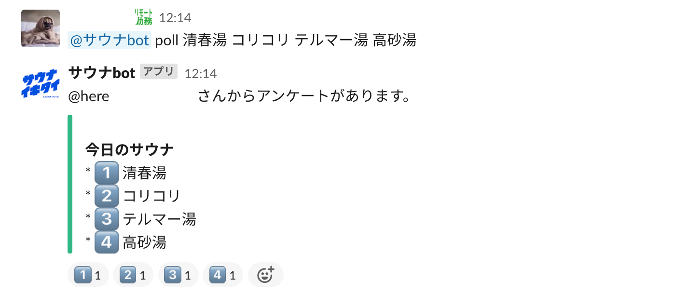

# sauna bot

## 機能

- 簡易な投票作成
  ```
  @サウナbot poll 清春湯 コリコリ テルマー湯 高砂湯
  ```
  

## 起動方法

現状、2 つのスクリプトが動いてます

- 対話的な機能部分

  `$ nohup poetry run python run.py &`

- bot 機能

  `$ nohup poetry run python schedule_exe.py &`
